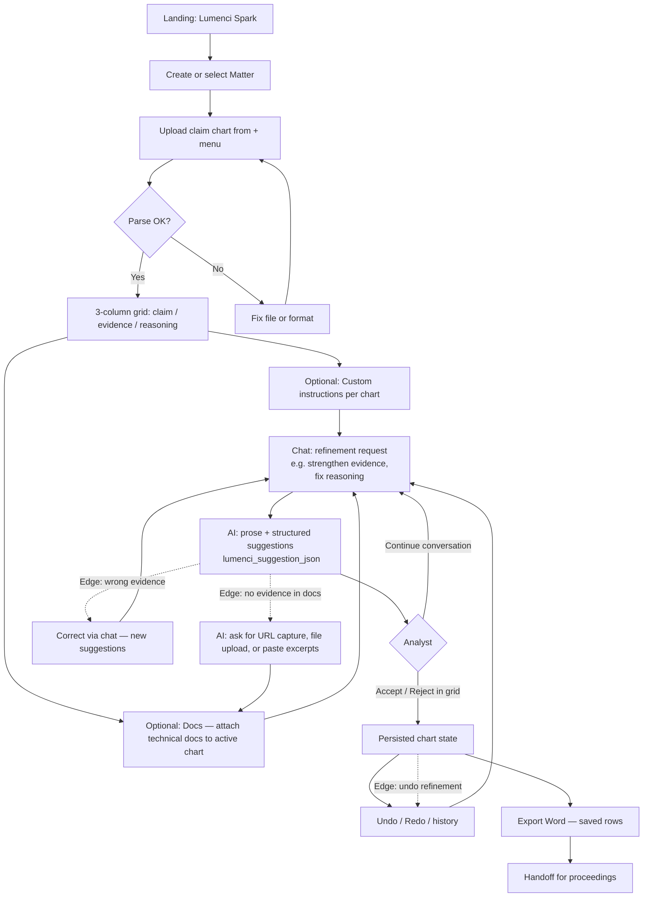

# Lumenci Spark — analyst user flow (assessment diagram)

Paste the block below into [Mermaid Live Editor](https://mermaid.live) to export PNG/SVG, or view this file on GitHub (renders Mermaid).

## Edge cases (assessment)

| Scenario | Product behavior |
|----------|------------------|
| AI cites wrong evidence | Analyst explains in chat; model issues corrected suggestions; accept/reject in grid. |
| Undo a refinement | **Undo** / **Redo** and edit history strip on the chart chrome. |
| AI cannot find evidence | Prompts analyst to use **Add evidence from URL** (server fetches public HTML and stores text), **upload** a file, or **paste excerpts** (localhost/private URLs are blocked). |
